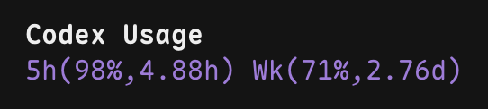

# @mufanc/opencode-codex-usage

OpenCode TUI plugin that shows Codex usage in the sidebar.



## Install

Install the plugin with OpenCode:

```bash
opencode plugin @mufanc/opencode-codex-usage
```

For local testing, you can install from a local path instead:

```bash
opencode plugin /absolute/path/to/opencode-codex-usage
```

Then restart OpenCode.

## Configuration

The default placement is `sidebar-footer`.

If you want to change the placement, update `tui.json` or `tui.jsonc`:

```json
{
  "plugin": [
    [
      "@mufanc/opencode-codex-usage",
      {
        "placement": "sidebar-content"
      }
    ]
  ]
}
```

Supported `placement` values:

- `"sidebar-footer"` (default)
- `"sidebar-content"`

## Notes

- Reads the OpenAI OAuth token from `~/.local/share/opencode/auth.json`.
- Fetches usage data from `https://chatgpt.com/backend-api/wham/usage`.
